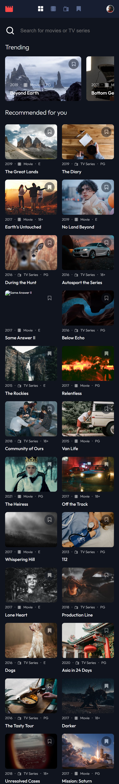

# Frontend Mentor - Entertainment web app solution

This is a solution to the [Entertainment web app challenge on Frontend Mentor](https://www.frontendmentor.io/challenges/entertainment-web-app-J-UhgAW1X). Frontend Mentor challenges help you improve your coding skills by building realistic project.

## Table of contents

- [Overview](#overview)
  - [The challenge](#the-challenge)
  - [Screenshot](#screenshot)
  - [Links](#links)
- [Built with](#built-with)
- [Author](#author)

## Overview

### The challenge

Users should be able to:

- View the optimal layout for the app depending on their device's screen size
- See hover states for all interactive elements on the page
- Navigate between Home, Movies, TV Series, and Bookmarked Shows pages
- Add/Remove bookmarks from all movies and TV series
- Search for relevant shows on all pages

### Screenshot

### Links

- Solution URL: (https://github.com/gkilasonia/entertainment-web-app)
- Live Site URL: (https://kilasa-entertainment-web-app.netlify.app/)

## Built with

- Semantic HTML5 markup
- CSS custom properties
- Flexbox
- CSS Grid
- Mobile-first workflow
- [React](https://reactjs.org/) - JS library
- API Data fatching with useQuery

## Author

- Frontend Mentor - [@gkilasonia](https://www.frontendmentor.io/profile/gkilasonia)
- LinkedIn - [@Giorgi Kilasonia](https://www.linkedin.com/in/giorgi-kilasonia-7a96ab190/)
